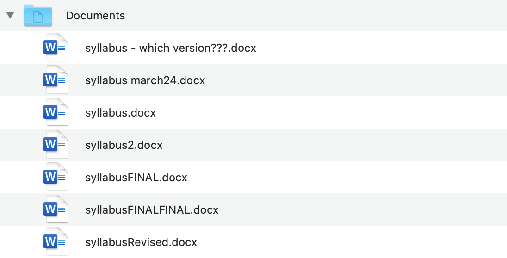
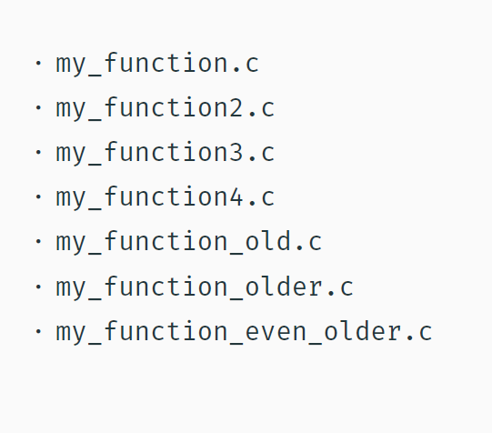

# What are Git & GitHub 
- In this 30 minute workshop participants will be introduced to what Git and Github are. 
- This workshop is discussion based only.

## Workshop objectives
- In this beginner-level workshop, participants will get an introduction to the general principles of Git and Github. No prior experience with Git or Github is required. 

   - Why use it? What You Can Do with Git and GitHub ?

* <a href="https://github.com/SouthernMethodistUniversity/git/blob/main/files/HPCgithubintro.pdf">Link to presentation slides</a>

# What is Git? (*software*) 

**Git** is *software* that you use on your laptop, or your local computer/machine. The software is used for *version control*—that is, tracking the state of files and changes you make to them over time. It is a Version Control System (VCS) [released in 2005.](https://en.wikipedia.org/wiki/Git)
- Git can be enabled in a folder, and then used to save the state of the contents in that folder at different points in the future, as designated by you. 
- In the language of Git, a folder (that is being tracked by Git) is called a *repository*. 
- Using Git, you can view a *log* of the changes you've made to the files in a repository and compare changes over time. 
- You can also revert back to previous versions, and create "branches" of a project to explore different futures. 
- Git is useful for collaboration, as a repository can be shared across computers, and its contents can be asynchronously developed and eventually merged with the main project.
- Version Control system (VCS) vs. distributed version control system (DVCS)
- Git was one of the first version control systems that followed a distributed revision control model (DRCS), in which it is no longer required to have a single server that all clients connect with.
   - [Read more about the version control system, Git, and how it works with GitHub.](https://docs.github.com/en/get-started/using-git/about-git)
   - [Automated Version Control](https://swcarpentry.github.io/git-novice/01-basics.html)

# What is GitHub? (*web based*) 

**GitHub** is an *online platform* for *hosting Git repositories.* It is a cloud-based platform that you access through your internet browser.
- It functions for some, predominantly programmers, as a social network for sharing and collaborating on code-based projects. 
- Users can share their own projects, as well as search for others, which they can then often work on and contribute to. 
- Digital Humanists, librarians, and other academics are also finding ways Git and GitHub are useful in writing projects and teaching. 
- GitHub also serves as a web-hosting platform, allowing users to create websites from their repositories.
- With GitHub, you are uploading your repository—as described above—from your local machine to this platform on the Internet to be shared more broadly.

# How We Use Git & GitHub for Version Control

## General use

**Versions Across Time** 

Version Control (aka revision control or source control) lets you track the history of your files over time. Why do you care? So when you mess up you can easily get back to a previous version that worked.
You’ve probably invented your own simple version control system in the past without realizing it. Do you have an directories with files like this?

While I probably can tell which version is the "final" one, I can not see what was changed along the way or how the different versions vary from each other.

It’s why we use ”Save As”; you want to save the new file without writing over the old one. It’s a common problem, and solutions are usually like this:
 - Make a *single backup copy* (e.g. Document.old.txt).
 - If we’re clever, we add a *version number* or *date*: e.g. Document_V1.txt, DocumentMarch2012.txt.
 - We may even use a *shared folder* so other people can see and edit files without sending them by email. Hopefully they rename the file after they save it.
      - With Git, you would save these multiple versions over time as one file, and each version you save includes a note about what has changed so you can easily revert back to an older version if needed.
 - By looking at the file list, you also can not tell who the file originally came from, or if there were contributions from many individuals. Git and GitHub can help make attribution clear, and maintain it over time as the file travels between hands.

*With version control*

- Nothing that is committed to version control is ever lost, unless you work really, really hard at it. Since all old versions of files are saved, it's always possible to go back in time to see exactly who wrote what on a particular day, or what version of a program was used to generate a particular set of results.
   - Teams are not the only ones to benefit from version control: lone researchers can benefit immensely.  Keeping a record of what was changed, when, and why is extremely useful for all researchers if they ever need to come back to the project later on (e.g., a year later, when memory has faded).
- As we have this record of who made what changes when, we know who to ask if we have questions later on, and, if needed, revert to a previous version, much like the "undo" feature in an editor.
- When several people collaborate in the same project, it's possible to accidentally overlook or overwrite someone's changes. The version control system automatically notifies users whenever there's a conflict between one person's work and another's.
- Version control is the lab notebook of the digital world: it's what professionals use to keep track of what they've done and to collaborate with other people.  Every large software development project relies on it, and most programmers use it for their small jobs as well.  And it isn't just for software: books, papers, small data sets, and anything that changes over time or needs to be shared can and should be stored in a version control system.

 [Click here for extended explanation of: What is version control](https://swcarpentry.github.io/git-novice/01-basics.html)

## Software projects

- A shared folder/naming system may work for class projects or one-time papers, but is exceptionally bad for software projects. Imagine that the Windows source code sits in a shared folder named something like ”Windows10-Latest-New”, for anyone to edit? Or that every programmer just works on different files in the same folder? 
- For projects that are large, fast-changing, or have multiple authors, a Version Control System (VCS) is critical. *Think of a VCS as a ”file database”, that helps to track changes and avoid general chaos.* 

   - **Backup and Restore** files are saved as they are edited, and you can jump to any moment in time. Need that file as it was on March 8? No problem.
   - **Synchronization** Allows people to share files and stay up to date with the latest version.
   - **Short-term undo** Did you try to “fix” a file and just mess it up? Throw away your changes and go back to the last ”correct” version in the database.
   - **Long-term undo** Sometimes we mess up bad. Suppose you made a change a year ago, and it had a bug that you never caught until now. Jump back to the old version, and see what change was made that day. Maybe you can fix that one bug and not have to undo your work for the whole year?
   - **Track Changes** As files are updated, you can leave messages explaining why the change happened (these are stored in the VCS, not the file). This makes it easy to see how a file is evolving over time, and why it was changed.
   - **Track Ownership** A VCS tags every change with the name of the person who made it, which can be hepful for laying blame or giving credit.
   - **Sandboxing** (i.e. insurance against yourself) -- Plan to make a big change? You can make temporary changes in an isolated area, test and work out the kinks before ”checking in” your set of changes.
   - **Branching and merging** A larger sandbox. You can branch a copy of your code into a separate area and modify it in isolation (tracking changes separately). Later, you can merge your work back into the common
area.
 [Click here for information on branches](https://docs.github.com/en/pull-requests/collaborating-with-pull-requests/proposing-changes-to-your-work-with-pull-requests/about-branches)

## Digital Humanities
- A [study of how Digital Humanists use GitHub](https://digitalscholarship.files.wordpress.com/2016/07/spirosmithdh2016githubpresentationfinal.pdf), conducted by Lisa Spiro and Sean Morey Smith, found that a wide range of users, including professors, research staff, graduate students, IT staff, and librarians commonly used the site in their DH work. They used GitHub for a diverse range of activities, such as:
- Developing software
- Sharing data sets
- Creating websites
- Writing articles and books
- Collating online resources
- Keeping research notes
- Hosting syllabi and course materials

## Open Science
- When version control is used diligently, it acts as a shareable electronic lab notebook for computational work
- It helps make code citable 
- [Open scientific work](https://swcarpentry.github.io/git-novice/10-open.html)

## Collaboration

**Collaborative Writing**

Git is also used in writing projects! _Version control_ makes tracking changes trackable, especially when there are multiple authors working asynchronously. It can be an alternative to using track changes in Microsoft Word, or comments and edits in a Google Doc.

## Instruction

**Syllabi sharing**
Increasingly we see that faculty are sharing their syllabi on GitHub (example: [DLCL 204: Digital Humanities Across Borders](https://github.com/quinnanya/dlcl204)).

**Class Websites**
Some instructors are even using GitPages that apply a user-friendly interface to their repository to make it easier to access and navigate for their students (examples: [DS 1300: A Practical Introduction to Data Science](https://southernmethodistuniversity.github.io/ds_1300/book/00_introduction.html) & [Digital History](https://digitalhistory.github.io/)). 

For courses in disciplines such as Data Sciences or Computer Science, instructors  will put assignments, code or notebooks in the class repository and may even require their students to submit assignments using GitHub. 

## Sharing and Attribution
As you can see [we use GitHub to host workshop curricula.](https://github.com/SouthernMethodistUniversity?q=git&type=all&language=&sort=) Hosting sessions on GitHub allows you (and anyone else interested in these topics!) to follow our repositories, and create your own version of the workshop based on our materials. This fosters open scholarship and knowledge sharing. It also facilitates attribution and citation by clearly tracking which content was created by whom, when it was added, and which projects or materials are derived from others.[As you can see in our acknowledgements](https://github.com/SouthernMethodistUniversity/git#acknowledgements)
- You can [add a citation file as well](https://swcarpentry.github.io/git-novice/12-citation.html)

---
# Actions
## Basic Actions
- Add: Put a file into the repo for the first time, i.e. begin tracking it with Version Control.
- Revision: What version a file is on (v1, v2, v3, etc.).
- Head/Tip: The latest revision in the repo.
- Check Out: Download a file from the repo.
- Check In: Upload a file to the repository (if it has changed). The file gets a new revision number, and people can “check out” the latest one.
- Check in Message: A short message describing what was changed.
- Changelog/History: A list of changes made to a file since it was created.
- Update/Sync: Synchronize your files with the latest from the repository. This lets you grab the latest revisions of all files.
- Revert: Throw away your local changes and reload the latest version from the repository.
### More advanced actions
- Branch: Create a separate copy of a file/folder for private use (bug fixing, testing, etc). Branch is both a verb (”branch the code”) and a noun (”Which branch is it in?”).
- Diff/Change/Delta: Finding the differences between two files. Useful for seeing what changed between revisions.
- Merge/Patch: Apply the changes from one file to another, to bring it up-to-date. For example, you can merge features from one branch into another.
- Conflict: When pending changes to a file contradict each other (both changes cannot be applied automatically).
- Resolve: Fixing the changes that contradict each other and checking in the final version.
- Locking: Taking control of a file so nobody else can edit it until you unlock it.Some version control systems use this to avoid conflicts.
- Breaking the lock: Forcibly unlocking a file so you can edit it. It may be needed if someone locks a file and goes on vacation.
- Check out for edit: Checking out an ”editable” version of a file. Some VCSes have editable files by default, others require an explicit command.

### [Repository Walkthrough](https://docs.github.com/en/repositories)
1.	Creating repositories
2.	Branching
3.	Merging
4.	Pushing and pulling
5.	Pull requests
6.	Forking

### Useful Repository Management Tips
1.	SSH keys
   - [Authentication documentation](https://docs.github.com/en/authentication)
2.	Branch restrictions
   - [Branch documentation](https://docs.github.com/en/repositories/configuring-branches-and-merges-in-your-repository)
3.	Project management
   - [Learning about Projects](https://docs.github.com/en/issues/planning-and-tracking-with-projects/learning-about-projects)
4.	Actions
   - [Actions documentation](https://docs.github.com/en/actions)

___ 
## Glossary for Git
- [Full Git Glossary](https://git-scm.com/docs/gitglossary)  
- Repository (repo): The database storing the files.
- Server: The computer storing the repo.
- Client: The computer connecting to the repo.
- Working Copy: Your local directory of files, where you make changes.
- Trunk/Main: The primary location for code in the repo. Think of code as a family tree — the trunk is the main line.

### Glossary for GitHub
- [Github Glossary:](https://docs.github.com/en/get-started/quickstart/github-glossary) This glossary introduces common Git and GitHub terminology.
